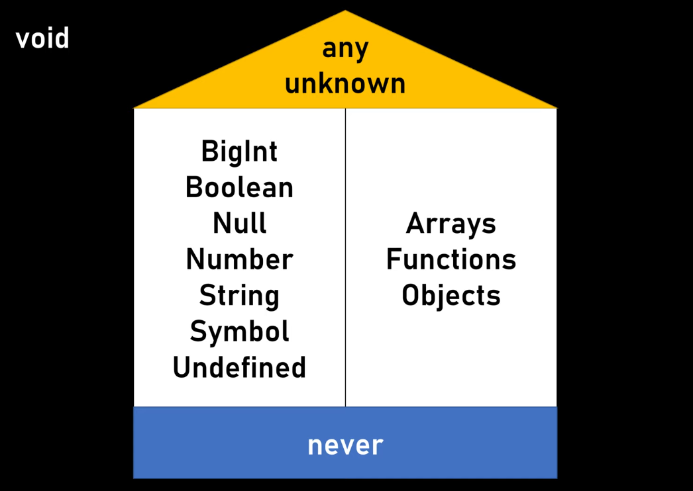
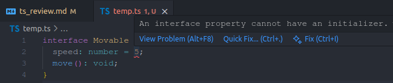

# TypeScript khác JavaScript ở điểm nào?
## What?
- Với mỗi `type` khác nhau của biến/hàm sẽ có thuộc tính và các phương thức sử dụng khác nhau.
- JavaScript chỉ cung cấp kiểu động (dynamic typing) một cách ngầm dịnh – chạy code để xem điều gì xảy ra.
- TypeScript giúp chúng ta tìm lỗi trước khi code chạy. TypeScript sử dụng thông tin đó kiểm tra kiểu (type-checker) và cho chúng ta biết khi nào mọi thứ có thể đi chệch hướng.

Ví dụ
```ts
const message = "hello!";

message();
```
Khi chạy đoạn code trên với TypeScript, sẽ nhận được thông báo lỗi trước khi chạy code: `This expression is not callable. Type 'String' has no call signatures.`

Khi viết code với type script ta sẽ khai báo tường minh kiểu của biến/tham số/hàm giúp lỗi được phát hiện sớm, tiết kiệm thời gian kiểm thử và sửa lỗi.
```ts
const message : string = "hello!";
```

## Why?
Sơ đồ minh họa:
```
        +------------------+
        |   JavaScript     |
        +------------------+
   viết code  ->  chạy code  ->  gặp lỗi runtime  -> Báo lỗi ❌


        +------------------+
        |   TypeScript     |
        +------------------+
   viết code  ->  compile check  ->  báo lỗi ngay ✅
```


# Interface và Type alias khác nhau thế nào?
## What?
- Khác nhau:
  - `interface`: dùng cho `object`, hỗ trợ mở rộng (extend) và hợp nhất (declaration merging), cho phép bạn dễ dàng extend các kiểu dữ liệu mà không phải thay đổi cấu trúc ban đầu.

  - `type`: dùng được cho mọi loại (object, union, primitive, function…), không hỗ trợ hợp nhất (declaration merging), nhưng có thể sử dụng với các kiểu giao hợp (intersection) để tạo ra kiểu dữ liệu mới. Type cho phép tạo type phức tạp, generic.

- Ví dụ
```ts
// Interface (object only)
interface User {
    name: string;
    age: number;
    email?: string; // Thuộc tính tùy chọn
}

const user: User = {
    name: "John",
    age: 30
};


// Type Alias (đa năng)
type PointT = {
  x: number;
  y: number;
};
type ID = string | number;

type ApiResponse<T> = { status: "ok"; data: T } | { status: "error"; message: string };

const res1: ApiResponse<number> = { status: "ok", data: 123 };
const res2: ApiResponse<string> = { status: "error", message: "Not found" };
```

Ví dụ về Mở rộng định nghĩa sau khi đã tạo:
```ts
// Interface có thể merge declarations
interface Window {
  title: string;
}

interface Window {
  ts: string;
}

const myWindow: Window = {
  title: "Hello",
  ts: "TypeScript API",
};
// 2 lần khai báo interface Window sẽ tự động gộp thành:
// interface Window {
//   title: string;
//   ts: string;
// }

// type thì không thể merge
type Window = {
  title: string;
};

type Window = {
  ts: string;
};

// ❌ Error: Duplicate identifier 'Window'
// Một type đã được định nghĩa thì không thể thay đổi thêm.

```

# Khi nào thì dùng any, unknown, never, void?
## What?

- `any` là kiểu thoát hiểm, đồng nghĩa với việc bỏ qua kiểm tra kiểu cho biến này trong TS.
- `unknown` là phiên bản an toàn hơn của any. Tuy nhiên, điểm khác biệt lớn là TypeScript không cho phép làm bất cứ điều gì với biến unknown cho đến khi kiểm tra và xác định được kiểu của nó.
- `void` là một kiểu dữ liệu đặc biệt, dùng để chỉ rằng không có giá trị trả về. Một biến có kiểu void chỉ có thể được gán giá trị `undefined` hoặc `null`, và không thể gán giá trị khác (số, chuỗi, object, ...) cho biến kiểu `void`.
- `never` đại diện cho một giá trị không bao giờ xảy ra. Nó được dùng cho những hàm không bao giờ kết thúc hoặc luôn luôn ném ra một lỗi.

- Sự khác biệt chính giữa `void` và `never` là:
  - `void`: Hàm hoàn thành bình thường, nhưng không có gì để trả về.
  - `never`: Hàm không bao giờ hoàn thành một cách bình thường.

## How?
- Nên hạn chế dùng `any` nhất có thể vì nó làm mất đi lợi ích cốt lõi của TypeScript là kiểm tra kiểu tĩnh. Chỉ dùng khi chưa rõ định kiểu của dữ liệu.
- Sử dụng `unknown` khi muốn kiểm tra dữ liệu từ một nguồn không chắc chắn, ví dụ như từ API, input của người dùng.
```js
let userInput: unknown;
let userName: string;

userInput = 5;
userInput = 'John';

// Lỗi! TypeScript không biết userInput có phải là string hay không.
// userName = userInput;

// Phải kiểm tra kiểu trước khi sử dụng
if (typeof userInput === 'string') {
  userName = userInput; // Bây giờ thì được
  console.log(userName.toUpperCase());
}
```

- Sử dụng `void` khi khai báo một hàm chỉ thực hiện một hành động mà không trả về kết quả. Ví dụ: hàm in ra console.
```ts
// Hàm này không có câu lệnh 'return'
function logMessage(message: string): void {
  console.log(message);
}

// Hàm này return nhưng không trả về giá trị cụ thể
function doSomething(): void {
  // ... làm gì đó
  return;
}
```

- Sử dụng `never` khi kiểu trả về của một hàm luôn ném ra lỗi, kiểu trả về của một hàm có vòng lặp vô tận và không bao giờ thoát ra, trong các phép kiểm tra kiểu để đảm bảo rằng một nhánh code nào đó không bao giờ được thực thi.

```js
// Hàm này luôn ném lỗi, không bao giờ trả về giá trị
function throwError(message: string): never {
  throw new Error(message);
}

// Hàm này có vòng lặp vô tận
function infiniteLoop(): never {
  while (true) {
    // ...
  }
}
```
# Optional property và readonly property là gì?
## What?
- `readonly property` là thuộc tính chỉ cho phép gán 1 lần và đọc nhiều lần. Sau khi gán giá trị cho thuộc tính mà gán lại sẽ báo lỗi. Giúp tránh thay đổi trực tiếp.

```js
interface Home {
  readonly resident: { name: string; age: number };
}

const home: Home = { resident: { name: "Alice", age: 30 } };
home.resident.age++; // ok
// home.resident = { name: "Bob", age: 40 }; // error
```
- `Optional property`: Khi một thuộc tính có thể không được cung cấp trong một đối tượng, sử dụng thêm dấu chấm hỏi (?) vào cuối tên của nó để tạo thuộc tính optional.


```ts
interface Person {
  name: string;
  age?: number;
}

function greet(person: Person) {
  // return "Hello " + person.age.toString(); // Object is possibly 'undefined'
  return "Hello " + (person.age?.toString() || "unknown age"); // Fix: person.age?.toString() hoặc kiểm tra if (person.age)
}
```

# Union type và Intersection type khác nhau thế nào?
## What?
- Union Type cho phép một biến/hàm có thể nhận nhiều kiểu giá trị khác nhau.
```ts
function printId(id: number | string) {
  console.log(id);
}

type ID = number | string;
```

- Intersection type được sử dụng để extend thuộc tính trong kiểu object của type
```ts
type Animal = {
  name: string;
};

type Bear = Animal & {
  honey: boolean;
};

const bear: Bear = { name: "Pooh", honey: true };
// Bear = hợp nhất Animal và { honey: boolean }.
```

- Ví dụ về sự khác nhau
```ts
let a: string | number; // string HOẶC number
let b: string & number; // Không thể, vì không thể vừa là string vừa là number
```

# Generics trong TypeScript là gì?, khi nào nên dùng Generics thay vì any?
## What?
- Vấn đề: Khi `Box` có thể chứa bất kỳ giá trị gì, kiểu any hoặc unknown có thể dùng, nhưng dễ gây lỗi runtime hoặc phải dùng nhiều type assertion.

```ts
interface Box {
  contents: any;
}
```
- Một cách tiếp cận an toàn kiểu là tạo ra các kiểu Box khác nhau cho mỗi loại nội dung.

```ts
interface NumberBox {
  contents: number;
}

interface StringBox {
  contents: string;
}

interface BooleanBox {
  contents: boolean;
}
```
- Nhưng điều đó có nghĩa là chúng ta sẽ phải tạo các hàm khác nhau, hoặc các overload của hàm, để hoạt động trên các kiểu này.
```ts
function setContents(box: StringBox, newContents: string): void;
function setContents(box: NumberBox, newContents: number): void;
function setContents(box: BooleanBox, newContents: boolean): void;
function setContents(box: { contents: any }, newContents: any) {
  box.contents = newContents;
}
```
Thay vào đó, chúng ta có thể tạo một kiểu Box chung (generic) khai báo một tham số kiểu.
```ts
interface Box<Type> {
  contents: Type;
}

function setContents(box: StringBox, newContents: string): void;

```

--> `Generics` là việc cho phép khởi tạo với nhiều kiểu dữ liệu khác nhau. Điều này sẽ giúp các components mềm dẻo hơn. Tái sử dụng tốt hơn.


# Sự khác nhau giữa interface và abstract class.
## What?

> When we talk about `abstract classes` we are defining characteristics of an object type; specifying what an object is.

> When we talk about an `interface` and define capabilities that we promise to provide, we are talking about establishing a contract about what the object can do.

## Why?
- Đa kế thừa
  - interface: Một lớp có thể implements nhiều interface.
  - abstract class: Một lớp chỉ có thể extends một abstract class.
- Khởi tạo
  - interface: Không thể chứa code triển khai cho phương thức và Không thể có thuộc tính với giá trị khởi tạo.
  - abstract class: Có thể chứa code triển khai cho phương thức và thuộc tính, constructor, và các phương thức với đầy đủ logic.

Hình dưới minh họa lỗi xảy ra khi cố gán giá trị cho thuộc tính trong interface.

## How?
- Sử dụng `interface` với từ khóa `implements`.
- Sử dụng `abstract class` với từ khóa `extends` và `abstract` cho các phương thức bắt buộc lớp con phải định nghĩa.

## Example

```ts
// --- INTERFACE EXAMPLE ---
interface Movable {
  speed: number;
  move(): void;
}
interface Chargeable {
  charge(): void;
}

class Car implements Movable, Chargeable {
  speed = 60;
  move() {
    console.log(`Driving at ${this.speed} km/h.`);
  }
  charge() {
    console.log("Car is charging...");
  }
}

class Person implements Movable {
  speed = 5;
  move() {
    console.log(`Walking at ${this.speed} km/h.`);
  }
}


// --- ABSTRACT CLASS EXAMPLE ---
// What: Một khuôn mẫu cho tất cả các loại phương tiện.
abstract class Vehicle {
  // Why: Chia sẻ thuộc tính và phương thức chung.
  constructor(public brand: string) {}

  // Phương thức đã được triển khai
  getBrand(): string {
    return `This vehicle is a ${this.brand}.`;
  }

  // How: Phương thức trừu tượng, bắt buộc lớp con phải định nghĩa.
  abstract startEngine(): void;
}

// Lớp con kế thừa từ khuôn mẫu.
class Motorcycle extends Vehicle {
  constructor(brand: string) {
    super(brand);
  }

  startEngine() {
    console.log("Motorcycle engine started... vrooom!");
  }
}

// Lỗi! Không thể tạo một thực thể của lớp trừu tượng.
// const myVehicle = new Vehicle("Some Brand");

const myMotorcycle = new Motorcycle("Honda");
console.log(myMotorcycle.getBrand()); // "This vehicle is a Honda."
myMotorcycle.startEngine(); // "Motorcycle engine started... vrooom!"

```

# Utility Types phổ biến (Partial, Pick, Omit, Readonly, Record) hoạt động thế nào?
## What?
- `Utility Types` là các kiểu generic được TypeScript xây dựng sẵn để giúp thay đổi hoặc tạo ra các kiểu mới từ những kiểu đã có một cách dễ dàng. Tham khảo các [Utility Types](https://www.typescriptlang.org/docs/handbook/utility-types.html#handbook-content).


## Why?
- Tăng tính linh hoạt: Dễ dàng tạo ra các kiểu phù hợp cho các trường hợp sử dụng cụ thể.
- Giữ code ngắn gọn và dễ bảo trì (nguyên tắc DRY - Don't Repeat Yourself).
- Tái sử dụng kiểu: Tạo ra các biến thể của một kiểu gốc mà không cần định nghĩa lại từ đầu.

## How?
Ví dụ với interface User
```ts
interface User {
  id: number;
  name: string;
  email: string;
  isAdmin: boolean;
}
```

### Partial<Type>
- Biến tất cả các thuộc tính của Type thành tùy chọn (optional).
- Kiểu `Partial<User>` tương đương: `{ id?: number; name?: string; email?: string; isAdmin?: boolean; }`
- Ví dụ:
```ts
function updateUser(id: number, data: Partial<User>) {
  // ... logic cập nhật
}
updateUser(1, { name: "New Name" }); // Hợp lệ
updateUser(2, { isAdmin: false }); // Hợp lệ
```


### Pick<Type, Keys>
- Tạo một kiểu mới bằng cách chọn một tập hợp các thuộc tính (Keys) từ Type.
- `Pick<User, 'id' | 'name'>` tương đương `{ id: number; name: string; }`
- Ví dụ:
```ts
const userSummary: Pick<User, 'id' | 'name'> = {
  id: 1,
  name: "John Doe",
};
console.log(userSummary); // { id: 1, name: 'John Doe' }
```

### Omit<Type, Keys>
-  Ngược lại với `Pick`, nó tạo ra một kiểu mới bằng cách loại bỏ một tập hợp các thuộc tính (Keys) từ Type.
- Ví dụ:
```ts
const publicUserInfo: Omit<User, 'isAdmin'> = {
  id: 1,
  name: "Jane Doe",
  email: "jane@example.com",
}; // { id: number; name: string; email: string; }
```


### Readonly<Type>
- Biến tất cả các thuộc tính của Type thành chỉ đọc, giúp ngăn chặn việc sửa đổi dữ liệu sau khi khởi tạo.
- Ví dụ:
```ts
const frozenUser: Readonly<User> = {
  id: 1,
  name: "Frozen User",
  email: "frozen@example.com",
  isAdmin: true,
};
// frozenUser.name = "New Name"; // Lỗi! Không thể gán vì nó là thuộc tính chỉ đọc.
```

# Làm sao để tạo generic constraint trong TS?
## What?
- `Generic Constraint` là giới hạn các kiểu dữ liệu có thể được sử dụng cho một tham số generic.

## How?
- Tạo ràng buộc bằng cách sử dụng từ khóa `extends` theo sau kiểu T phải tuân thủ. `function <T extends ConstraintType>(arg: T)`

## Example
- Đoạn code dưới đây lỗi vì T có thể là bất cứ thứ gì, ví dụ như number hoặc boolean, vốn không có thuộc tính `.length`.

```ts
function logLength<T>(arg: T) {
  // Lỗi: Property 'length' does not exist on type 'T'.
  console.log(arg.length);
}
```

Giải pháp
```ts
interface WithLength {
  length: number;
}

function logLength<T extends WithLength>(arg: T): void {
  // Bây giờ TypeScript biết chắc chắn arg sẽ có thuộc tính .length
  console.log(`Length: ${arg.length}`);
}

logLength("hello world"); // Hợp lệ
logLength([1, 2, 3]);   // Hợp lệ
logLength({ length: 10, value: 'test' }); // Hợp lệ
// logLength(123); // Lỗi! Argument of type 'number' is not assignable to parameter of type 'WithLength'.
```

# Decorator trong TS là gì? Decorator áp dụng nguyên lý gì trong SOLID?
## What?
- Decorator là một hàm được gọi tại thời điểm định nghĩa (không phải lúc thực thi), cho phép quan sát, sửa đổi, hoặc thay thế định nghĩa của đối tượng được decorator. Cú pháp của nó là `@expression`

- `Decorator` cho phép đính kèm các hàm vào các khai báo class, method, property hoặc parameter.


## Example
```ts
// Decorator function
function LogMethod(target: any, propertyName: string, descriptor: PropertyDescriptor) {
  const originalMethod = descriptor.value; // Lưu lại phương thức gốc

  // Sửa đổi phương thức
  descriptor.value = function(...args: any[]) {
    console.log(`Calling "${propertyName}" with arguments:`, args);
    const result = originalMethod.apply(this, args); // Gọi phương thức gốc
    console.log(`Method "${propertyName}" returned:`, result);
    return result;
  }
}

class Calculator {
  // Áp dụng decorator vào phương thức add
  @LogMethod
  add(a: number, b: number): number {
    return a + b;
  }
}

const calc = new Calculator();
calc.add(2, 3);

// Output
// > Calling "add" with arguments: [ 2, 3 ]
// > Method "add" returned: 5
```

## Why?
- Áp dụng nguyên lý Đóng/Mở (Open/Closed Principle) trong SOLID.
  - Mở rộng: Dễ dàng thêm các chức năng mới (logging, validation, caching...) vào một lớp mà không cần chạm vào code của nó.
  - Đóng: Lớp `Calculator` vẫn giữ nguyên logic cốt lõi, không cần phải vào phương thức add để viết thêm code `console.log`.
